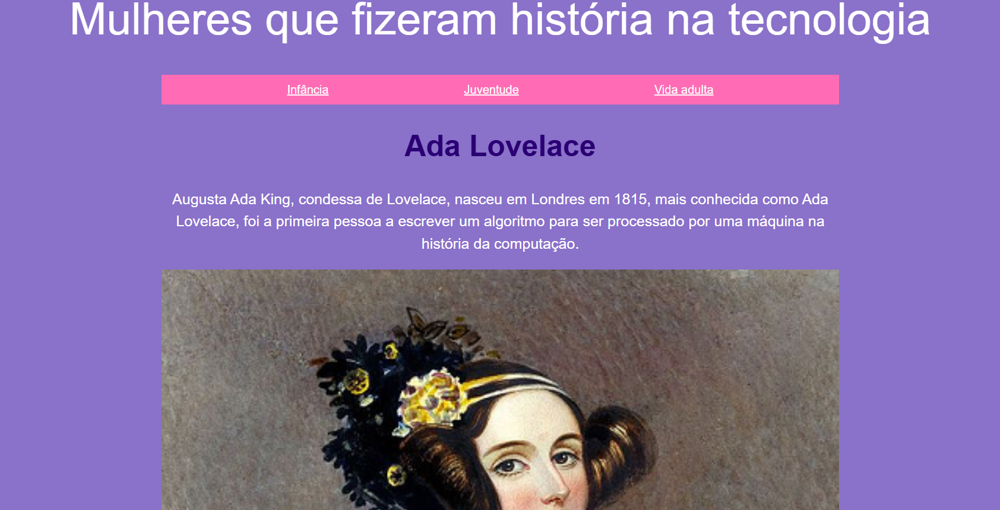
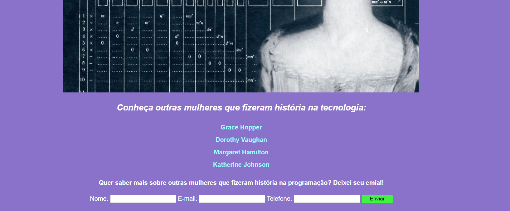

# 👩‍💻 Mulheres na Tecnologia

Projeto desenvolvido durante o curso **"Eu Programo"** da [Programaria](https://programaria.org/), com o objetivo de fortalecer meus conhecimentos em **HTML**, **CSS** e **JavaScript**, além de destacar a importância das mulheres na história da tecnologia.

## 💡 Sobre o Projeto

Este é um site informativo que celebra mulheres que marcaram a história da tecnologia. O destaque principal vai para **Ada Lovelace**, considerada a primeira programadora da história.

O site apresenta seções com:

- Um mini resumo sobre Ada Lovelace
- Navegação por fases da vida (infância, juventude e vida adulta)
- Sugestões de outras mulheres inspiradoras na tecnologia
- Um formulário funcional feito com JavaScript para que visitantes deixem seus contatos

## 🔧 Tecnologias Utilizadas

- HTML5
- CSS3
- JavaScript

## 📷 Capturas de Tela

### Página Principal

### Formulário em JavaScript

## 🚀 Funcionalidades

- Layout colorido e responsivo
- Conteúdo informativo sobre mulheres da tecnologia
- Links para saber mais sobre outras cientistas
- Formulário com validação básica usando JavaScript

## 🧠 Aprendizados

Durante esse projeto, pude praticar:

- Estruturação de páginas HTML
- Estilização com CSS (tipografia, cores, espaçamento)
- Manipulação de formulários com JavaScript

---

Feito por [Fernanda Canêjo](https://github.com/fernandacanejo)
